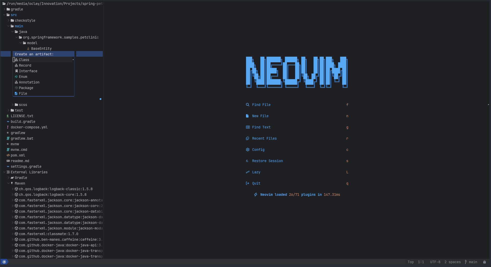

<br/>
<!-- <div align="center"> -->
<!--   <a  href="https://github.com/oclay1st/neojava.nvim"> -->
<!--      -->
<!--   </a> -->
<!-- </div> -->

**neojava.nvim** is a source plugin of Neotree to explore your Java projects.



## 🔥 Status
This plugin is under **development** and has some known issues, so it is not considered stable enough

## ✨ Features

- Create classes, records, interfaces, enums and annotations inside the packages
- Autodetect java projects and group folders like packages
- Navigate through your project dependencies using maven.nvim and gradle.nvim plugins

## ⚡️ Requirements

-  Neovim 0.10 or superior
-  For Unix systems:
   - `unzip`
-  For Windows systems(untested):
   - `GNU tar`

## 📦 Installation

### lazy.nvim

```lua
{
    'nvim-neo-tree/neo-tree.nvim',
    branch = 'v3.x',
    dependencies = {
        'nvim-lua/plenary.nvim',
        'nvim-tree/nvim-web-devicons', -- not strictly required, but recommended
        'MunifTanjim/nui.nvim',
        { 'oclay1st/neojava.nvim' },
    }
}
```

## ⚙️  Default options of Neojava source on the Neotree configuration

```lua
{
    -- ... More Neotree configuration
    neojava = {
        window = {
            mappings = {
                ['H'] = 'toggle_hidden',
                ['/'] = 'fuzzy_finder',
                ['D'] = 'fuzzy_finder_directory',
                --["/"] = "filter_as_you_type", -- this was the default until v1.28
                ['#'] = 'fuzzy_sorter', -- fuzzy sorting using the fzy algorithm
                -- ["D"] = "fuzzy_sorter_directory",
                ['f'] = 'filter_on_submit',
                ['<C-x>'] = 'clear_filter',
                ['<bs>'] = 'navigate_up',
                ['.'] = 'set_root',
                ['[g'] = 'prev_git_modified',
                [']g'] = 'next_git_modified',
                ['i'] = 'show_file_details',
                ['o'] = { 'show_help', nowait = false, config = { title = 'Order by', prefix_key = 'o' } },
                ['oc'] = { 'order_by_created', nowait = false },
                ['od'] = { 'order_by_diagnostics', nowait = false },
                ['og'] = { 'order_by_git_status', nowait = false },
                ['om'] = { 'order_by_modified', nowait = false },
                ['on'] = { 'order_by_name', nowait = false },
                ['os'] = { 'order_by_size', nowait = false },
                ['ot'] = { 'order_by_type', nowait = false },
            },
            fuzzy_finder_mappings = { -- define keymaps for filter popup window in fuzzy_finder_mode
                ['<down>'] = 'move_cursor_down',
                ['<C-n>'] = 'move_cursor_down',
                ['<up>'] = 'move_cursor_up',
                ['<C-p>'] = 'move_cursor_up',
            },
        },
        async_directory_scan = 'auto', -- "auto"   means refreshes are async, but it's synchronous when called from the Neotree commands.
        -- "always" means directory scans are always async.
        -- "never"  means directory scans are never async.
        scan_mode = 'deep', -- "shallow": Don't scan into directories to detect possible empty directory a priori
        -- "deep": Scan into directories to detect empty or grouped empty directories a priori.
        bind_to_cwd = true, -- true creates a 2-way binding between vim's cwd and neo-tree's root
        cwd_target = {
            sidebar = 'tab', -- sidebar is when position = left or right
            current = 'window', -- current is when position = current
        },
        check_gitignore_in_search = true, -- check gitignore status for files/directories when searching
        -- setting this to false will speed up searches, but gitignored
        -- items won't be marked if they are visible.
        -- The renderer section provides the renderers that will be used to render the tree.
        --   The first level is the node type.
        --   For each node type, you can specify a list of components to render.
        --       Components are rendered in the order they are specified.
        --         The first field in each component is the name of the function to call.
        --         The rest of the fields are passed to the function as the "config" argument.
        filtered_items = {
            visible = false, -- when true, they will just be displayed differently than normal items
            force_visible_in_empty_folder = false, -- when true, hidden files will be shown if the root folder is otherwise empty
            show_hidden_count = true, -- when true, the number of hidden items in each folder will be shown as the last entry
            hide_dotfiles = true,
            hide_gitignored = true,
            hide_hidden = true, -- only works on Windows for hidden files/directories
            hide_by_name = {
                '.DS_Store',
                'thumbs.db',
                --"node_modules",
            },
            hide_by_pattern = { -- uses glob style patterns
                --"*.meta",
                --"*/src/*/tsconfig.json"
            },
            always_show = { -- remains visible even if other settings would normally hide it
                --".gitignored",
            },
            always_show_by_pattern = { -- uses glob style patterns
                --".env*",
            },
            never_show = { -- remains hidden even if visible is toggled to true, this overrides always_show
                --".DS_Store",
                --"thumbs.db"
            },
            never_show_by_pattern = { -- uses glob style patterns
                --".null-ls_*",
            },
        },
        find_by_full_path_words = false, -- `false` means it only searches the tail of a path.
        -- `true` will change the filter into a full path
        -- search with space as an implicit ".*", so
        -- `fi init`
        -- will match: `./sources/filesystem/init.lua
        --find_command = "fd", -- this is determined automatically, you probably don't need to set it
        --find_args = {  -- you can specify extra args to pass to the find command.
        --  fd = {
        --  "--exclude", ".git",
        --  "--exclude",  "node_modules"
        --  }
        --},
        ---- or use a function instead of list of strings
        --find_args = function(cmd, path, search_term, args)
        --  if cmd ~= "fd" then
        --    return args
        --  end
        --  --maybe you want to force the filter to always include hidden files:
        --  table.insert(args, "--hidden")
        --  -- but no one ever wants to see .git files
        --  table.insert(args, "--exclude")
        --  table.insert(args, ".git")
        --  -- or node_modules
        --  table.insert(args, "--exclude")
        --  table.insert(args, "node_modules")
        --  --here is where it pays to use the function, you can exclude more for
        --  --short search terms, or vary based on the directory
        --  if string.len(search_term) < 4 and path == "/home/cseickel" then
        --    table.insert(args, "--exclude")
        --    table.insert(args, "Library")
        --  end
        --  return args
        --end,
        group_empty_dirs = false, -- when true, empty folders will be grouped together
        search_limit = 50, -- max number of search results when using filters
        follow_current_file = {
            enabled = true, -- This will find and focus the file in the active buffer every time
            --               -- the current file is changed while the tree is open.
            leave_dirs_open = false, -- `false` closes auto expanded dirs, such as with `:Neotree reveal`
        },
        hijack_netrw_behavior = 'open_default', -- netrw disabled, opening a directory opens neo-tree
        -- in whatever position is specified in window.position
        -- "open_current",-- netrw disabled, opening a directory opens within the
        -- window like netrw would, regardless of window.position
        -- "disabled",    -- netrw left alone, neo-tree does not handle opening dirs
        use_libuv_file_watcher = false, -- This will use the OS level file watchers to detect changes
        -- instead of relying on nvim autocmd events.
    }
}
```

## 🎨 Highlight Groups

<!-- colors:start -->

| Highlight Group | Default Group | Description |
| --- | --- | --- |
| **NeojavaTestFolder** | ***Normal*** | Normal text |
| **NeojavaBuildFolder** | ***Normal*** | Normal text |

<!-- colors:end -->
